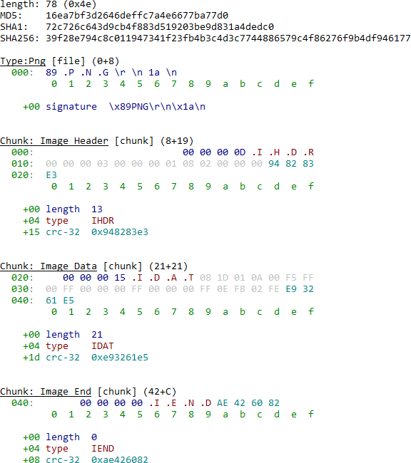

Sbud is being rewritten from scratch, in private for now.

This repository will be rebuild from scratch in the future.
For the time being, consider it as an obsolete stepping stone.


# SBuD

SBuD is an **experimental playground** related to file formats parsing and visualization.

It's *merely a suggestion* at this stage - its design and code could change at any time (it's at least its 3rd iteration).
Don't expect a working tool yet.

SBuD is made of 2 types of components, Dis and Dat, which can work together but are not required to each other.

<!--
digraph {
  rankdir=LR;
  node [shape=none,fontname=monospace];
  file;
  ASM;
  Json;
  PDF;
  HTML;
  SVG;
  RTF;
  ANSI;

  node [shape=oval, fontname="Arial Black"];
  file -> Dis;
  Dis -> ASM;
  Dis -> Json;
  Json -> "DatPy"-> ANSI -> HTML;
  Json -> "DatJS" -> SVG -> PDF;
  ANSI -> RTF;
}
-->


## Dis (-sector/sassembler)

Parses input files to:
- generate JSON for visual representation via Dat.

```
{
 "fileName": "rgb.png", 
 "length": 78, 
 "struc": {
  "name": "Type:PNG", 
  "offset": 0, 
  "subEls": [
   {
    "ASCII": true, 
    "name": "signature", 
    "offset": 0, 
    "size": 8, 
    "type": "magic", 
    "value": "\\x89PNG\\r\\n\\x1a\\n"
   }, 
[...]
```

- generate Assembly source to rebuild the file via Nasm/Yasm.

```
db `\x89PNG\r\n\x1a\n`                            ; signature                    ;0000: 89 50 ..... 1a 0a (+8)

chunk1:                                           ; chunk1 { //Image Header
 ddbe 13                                          ;  length                      ;0008: 00 00 00 0d (+4)
;ddbe (chunk1.crc32 - chunk1.data)

.type db `IHDR`                                   ;  type                        ;000c: 49 48 44 52 (+4)

.data:                                            ; Data {
  incbin 'rgb.png', 0x10, 0xd                                                    ;0010: 00 00 ..... 00 00 (+13)
  ;}                                              ;   } //Data

.crc32 ddbe 0x948283e3                            ;  crc-32                      ;001d: 94 82 83 e3 (+4)
 ;> chunk1.crc32=CRC32(chunk1.type,chunk1.crc32)
;}                                                ; } //chunk

[...]
```


## Dat(-a visualizer)

Exists in 2 flavors:
- DatPy exports to ANSI text, which can then be converted to HTML (to paste in web forms), RTF (to paste in Office Files) or TeX via tools like [AnsiFilter](http://www.andre-simon.de/doku/ansifilter/en/ansifilter.php)



*light in narrow mode*


*dark in wide mode*

- DatJS is relying on [Albert](https://github.com/evoL/albert) to render SVG in the browser. It can be converted to PDF.


*light Ansi theme*


*Shades of Purple theme*
